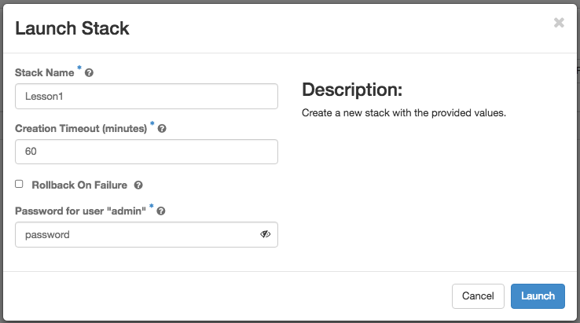
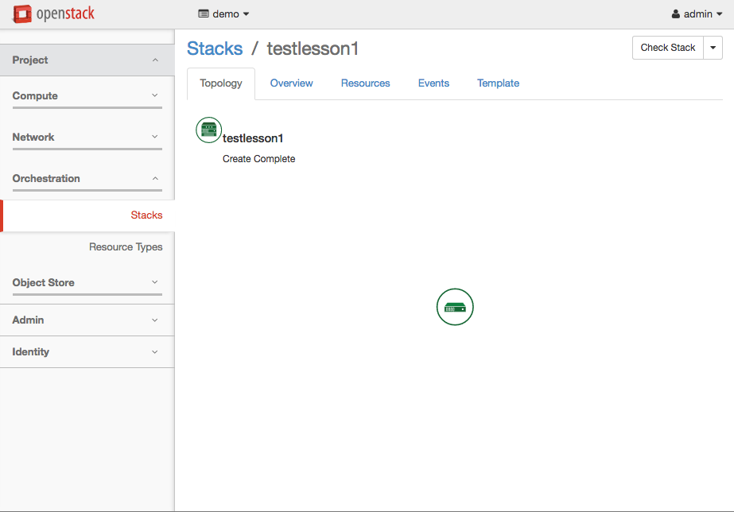

# Example #1: A Single VM
This is the HEAT equivalent of a "hello world" program. The smallest possible
HEAT template that is still useful. In this example, we're provisioning a
single virtual machine, with one network connection.

## HOT Template
[lesson1.hot](media/lesson1.hot)
```yaml
heat_template_version: 2014-10-16
description: The SMALLEST possible working HEAT template

resources:
    cluster_master:
        type: OS::Nova::Server
        properties:
            key_name: derek_ssh
            image: Centos-7-x86_64
            flavor: m1.small
            name: lesson1.server
            networks:
              - network: private

```

## Launching
If we paste this HOT template into the UI, and click next, we'll find ourselves
with a few options to fill out. These are the default
[parameters](glossary.md#Parameters) which are always present for any HOT.

We'll fill those out with some throwaway values, and continue on:



## Topological View
Once we hit the launch button, we're kicked back to the Orchestration root
menu. From here we can go take a look at the results of our (minimal) labours.
Click on the name of the HOT that you deployed in this view, and you're taken
to a view that shows the different components used for your HEAT stack. While
this is only showing a single instance in this view, it can be quite useful
for larger and more complex HEAT stacks:


